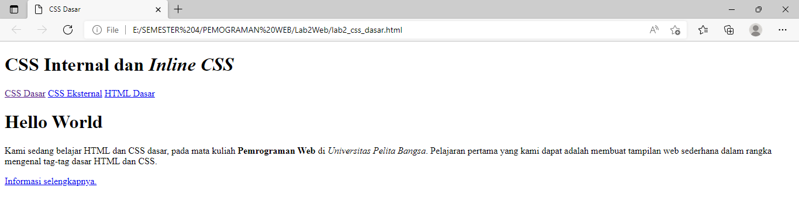
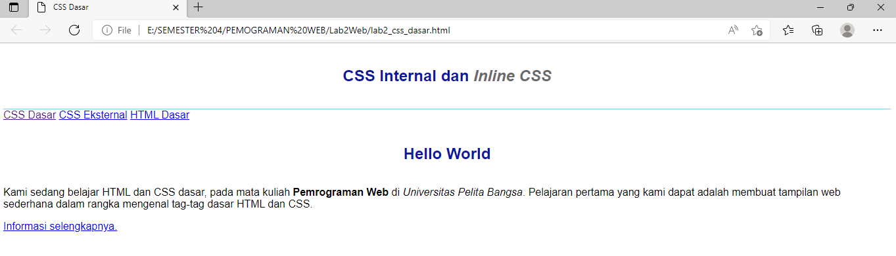

# Lab2Web
Tugas pertemuan 3 CSS Pemograman Web

Saya akan membuat tugas pertemuan 3 Lab2Web

Nama : Abdul Rahman

NIM : 312010061

Kelas : TI.20.B.1

1. Membuat dokumen HTML

2. Membuat Mendeklarasikan CSS Internal

